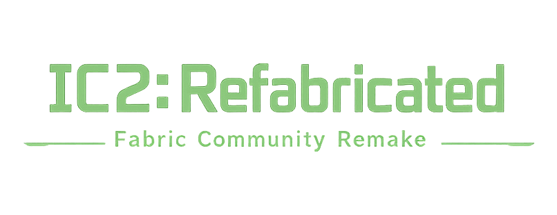

# IC2-120

<big>[English](README_EN.md) | [简体中文](README.md)</big>

> 📢 QQ Group: 638382077 (bug reports, dev progress discussion, talk with the author, etc.)

> **⚠️ Required: Installation** To use this mod, you must copy **both files** from the release to your Minecraft mods folder:
> - `ic2_120-*.jar` - Main mod file (Energy API bundled)
> - `fabric-language-kotlin-*.jar` - Fabric Kotlin language support library
> Both files are required, otherwise the mod will not work.

> **📢 Sinytra Connector Support**: This mod has been adapted for [Sinytra Connector](https://github.com/Sinytra/connector) and can also run on Forge via Connector. For instructions on using Connector to load Fabric Mods in a Forge environment, please refer to the [official Sinytra Connector documentation](https://github.com/Sinytra/connector).

IndustrialCraft 2 Minecraft 1.20.1 Fabric port, written in Kotlin.

## Installation Statistics

The chart below shows the daily active installs over the last 30 days (anonymous, counts only, no personal data; can be disabled in config):


**Player Guide**: Gameplay documentation is maintained only in the in-game Guidebook under `core/src/main/resources/assets/ic2_120/guidebook/main`. This document is for developers.

## Project Features

- 📦 Based on Fabric Loader and Fabric API
- 🔧 Developed with Kotlin 2.3.10
- ⚡ Class-level annotation registration system for streamlined mod development
- 🎨 Embedded in-house ComposeUI declarative GUI DSL
- 🔌 EU energy network system
- 🏭 Complete industrial machine suite (generators, processing machines, storage devices, etc.)

## Development Environment Requirements

- JDK 17 or higher
- Minecraft 1.20.1
- Fabric Loader
- Fabric API

## Tech Stack

- **Kotlin** 2.3.10 - Primary development language
- **Fabric Loom** - Gradle build plugin
- **Fabric API** - Minecraft mod API
- **ComposeUI** - Embedded in-house declarative GUI DSL (built on DrawContext, not JetBrains Compose)
- **[mcdebug](https://github.com/yu1745/mcdebug)** - In-game automated block/machine testing tool (spins up a dev server to run TS tests)

## Project Structure

Multi-module Gradle project; `core` is the main mod, the rest are add-ons:

```
ic2-fabric/
├── core/                    # Main mod (IC2 content, energy/fluid/kinetic networks, machines, GUI)
│   └── src/{main,client}/   #   main=common/server, client=client-side (kotlin + java)
├── advanced-solar-addon/    # Advanced Solar Panels add-on
├── advanced-weapons-addon/  # Advanced Weapons add-on
├── buildcraft-addon/        # BuildCraft integration (engines/pumps/oil worldgen)
├── addon-template/          # Add-on template (not part of the build)
├── docs/                    # Technical documentation
├── libs/                    # Local dependencies
├── scripts/                 # Helper scripts
└── tests/                   # Tests (incl. mcdebug machine/block tests)
```

## Documentation

> The single source for the doc index is [`AGENTS.md`](AGENTS.md) (= `CLAUDE.md`; §1/§5/§6 hold the full guides/systems/ui/registry/pitfalls index and hard rules). Below are common human-facing entry points only:

- [Machine Implementation Guide](docs/guides/machine-implementation-guide.md) - Complete Block → BlockEntity → ScreenHandler → Screen workflow
- [Class-based Annotation Registration System](docs/registry/CLASS_BASED_REGISTRY.md) - Automatic registration using annotations and enums
- [Machine Composition Reuse](docs/guides/machine-composition-reuse.md) - Machine logic composition and reusable design
- [ComposeUI Declarative GUI](docs/ui/compose-ui.md) - GUI layout and rendering system
- [Energy Network System](docs/systems/energy-network.md) - EU energy transmission and storage
- [Fluid System](docs/systems/fluid-system.md) - Fluid pipes, pump attachments, and transmission rules (Chinese)
- [Implemented Items List](docs/guides/item-implemented.md) - List of currently implemented items

## Features Not Planned

The following are intentionally out of scope for this port; use the suggested mods instead:

### 🏔️ Terraforming Series (use Create)
- Terraformer and its templates (cultivation, forestation, desertification, mushroom, etc.), construction templates

### 📦 Logistics Series (use AE2)
- Item Buffer, Weighted Item Distributor, Sorting Machine, logistics pipes and filters

> Steam machines, the Blast Furnace, and kinetic generation (wind/water/manual/leash kinetic generators) are all implemented; see the in-game Guidebook for usage and recipes.

## Contributing

Issues and Pull Requests are welcome!

## Copyright & License

**⚠️ Important Notice**

This project is a reverse engineering project based on IndustrialCraft 2 (IC2). The original IC2 mod is **not open-source software**, and its source code and assets are not officially authorized for public use.

The assets in this repository under `core/src/main/resources/assets/ic2` and `core/src/main/resources/assets/minecraft` directories (including but not limited to models, textures, language files, recipes, and related data) were organized through reverse engineering and are intended for compatibility research and technical verification only. This does not imply any authorization from the original IC2 project, Minecraft project, or related rights holders.

This project is for **learning and research purposes only** and must not be used for commercial purposes. If you are a copyright holder of IC2 and believe this project infringes on your rights, please contact us.

Except as otherwise required by law, the authors and contributors of this repository assume no liability for any direct or indirect legal consequences resulting from the use, distribution, modification, or redistribution of this project; users should verify the legality of their actions in their jurisdiction and assume all risks.

## Related Links

- [Fabric Official Documentation](https://fabricmc.net/wiki/)
- [Fabric API GitHub](https://github.com/FabricMC/fabric)
- [Minecraft 1.20.1 Version](https://www.minecraft.net/)

## Versions & Dependencies

- Game: Minecraft `1.20.1`
- Loader: Fabric Loader `0.18.4`
- Dependencies: Fabric API, Fabric Language Kotlin `1.13.9+kotlin.2.3.10` (Energy API bundled)
- Mod version: `0.3`
- Compatibility: Sinytra Connector (runs under Forge + Connector)
